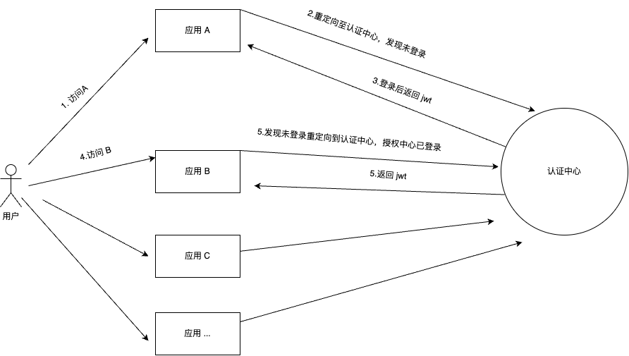

# SSO 单点登录方案

## 什么是 SSO

SSO（Single Sign-On，单点登录）是一种常见的企业级应用架构模式，它允许多个应用系统共用一个身份认证中心，用户只需要登录一次，即可访问所有相关的应用系统。

## 优点

- 减少用户认证次数，提高用户体验
- 统一认证中心，降低运维成本
- 减少认证中心的单点故障，提高系统可用性

## 适用场景

- 企业内部应用系统
- 第三方应用系统
- 多租户系统
  
## 实现方案

### 根域名共享 Cookie

假设有两个应用系统，分别为 A 和 B，它们都部署在不同的子域名下，如：

- A 系统部署在 `a.example.com`
- B 系统部署在 `b.example.com`

只要登录的时候把 cookie 的 domain 设置为根域名 `example.com`，就可以实现 SSO。

- 优点： 
  - 实现简单，无需额外的组件
  - 适用于内部应用系统
  - 无需额外的认证中心
- 缺点： 
  - 无法实现多租户系统的单点登录
  - 无法实现第三方应用系统的单点登录
  - 如果根域名不同，子系统无法实现单点登录

### 认证中心方案

上述的根域名共享方案，因此需要引入认证中心。

- 集中认证中心：所有应用系统都通过认证中心认证，用户只需登录一次，即可访问所有相关的应用系统。

### 集中认证服务 (Centralized Authentication Service)

- 优点： 
  - 减少用户认证次数，提高用户体验
  - 统一认证中心，降低运维成本
  - 减少认证中心的单点故障，提高系统可用性
- 缺点： 
  - 单点故障会影响所有应用系统
  - 认证策略需要统一，不利于应用系统的个性化定制
  - 认证中心需要高可用，否则整个系统不可用

