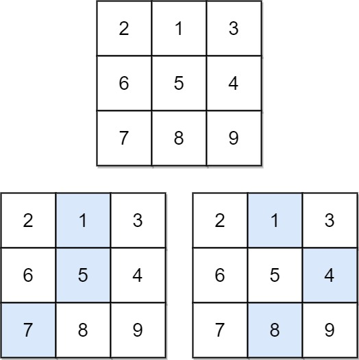

# 最小下降路径
## TODO
LeetCode [最小下降路径](https://leetcode-cn.com/problems/minimum-falling-path-sum/)


## 题目描述


给你一个 n x n 的 方形 整数数组 matrix ，请你找出并返回通过 matrix 的下降路径 的 最小和 。

下降路径 可以从第一行中的任何元素开始，并从每一行中选择一个元素。在下一行选择的元素和当前行所选元素最多相隔一列（即位于正下方或者沿对角线向左或者向右的第一个元素）。具体来说，位置 (row, col) 的下一个元素应当是 (row + 1, col - 1)、(row + 1, col) 或者 (row + 1, col + 1) 。

 

示例 1：



输入：matrix = [[2,1,3],[6,5,4],[7,8,9]]
输出：13
解释：如图所示，为和最小的两条下降路径

示例 2：

输入：matrix = [[-19,57],[-40,-5]]
输出：-59
解释：如图所示，为和最小的下降路径
 

提示：

- n == matrix.length == matrix[i].length
- 1 <= n <= 100
- -100 <= matrix[i][j] <= 100

## 解题思路

动态规划问题，状态转移方程为：

dp[i][j] = min(dp[i-1][j-1], dp[i-1][j], dp[i-1][j+1]) + matrix[i][j]

即，当前位置的下降路径和等于其左、右、上三个位置的下降路径和加上当前位置的值。

初始化：

dp[0][j] = matrix[0][j]

结果：

`Math.min(...dp[len - 1])`

时间复杂度：O(n^2)


## 代码实现

```js
/**
 * @param {number[][]} matrix
 * @return {number}
 */
var minFallingPathSum = function (matrix) {
  const len = matrix.length;
  // 创建dp 代表到达当前坐标最小和
  const dp = new Array(len).fill(0).map(() => new Array(len).fill(0));
  // dp 循环记录
  for (let i = 0; i < len; i++) {
    for (let j = 0; j < len; j++) {
      // 第一行 直接赋值
      if (i === 0) {
        dp[i][j] = matrix[i][j];
        continue;
      }
      // 状态转移方程最小值判断
      const min = Math.min(
        dp[i - 1][j - 1] ?? Infinity,
        dp[i - 1][j + 1] ?? Infinity,
        dp[i - 1][j] ?? Infinity
      );
      dp[i][j] = min === Infinity ? matrix[i][j] : min + matrix[i][j];
    }
  }

  // 最后一行的最小值
  return Math.min(...dp[len - 1]);
};
```