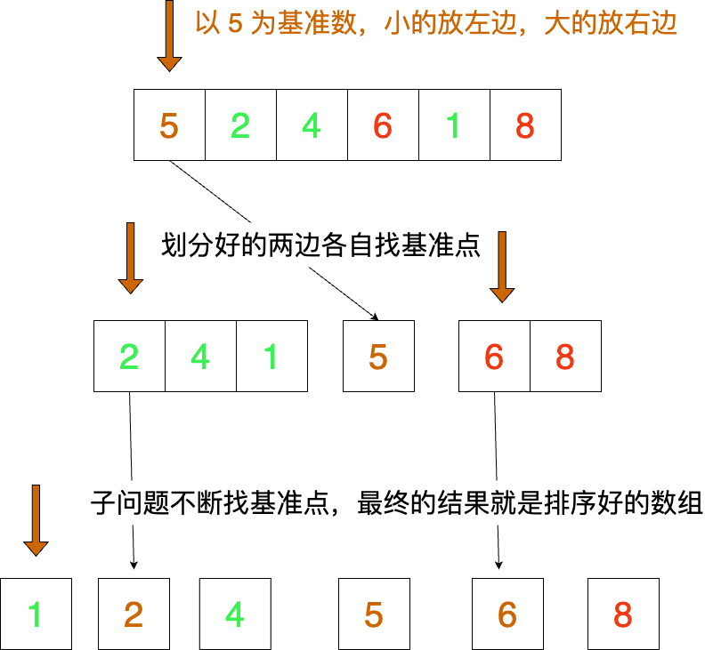

# 快速排序

## 核心思想

快速排序的核心是二分，不断的二分能减少很多不必要的比较。

快速排序的原理是什么呢？
假设有一组数据 
```
[5,2,4,6,3,8]
```
我们找一个值作为基准，小于这个值的放左边，大于这个值的放右边。
我们以最最左边的 `5` 作为中间值，那么第一轮划分准备左右两个数组存放。

```js
left = [2,4,3]
right = [6,8]
// 拼起来是这样的
arr = [...left,5,...right]// [2,4,3,5,6,8]
```

我们来看图解：




从简单的开始，使用额外空间来划分。
我们来看基础模板，思考后再看完整解法


:::code-group

```js [解法模板]
function quickSort(arr) {
  // TODO: 什么时候停止递归？
  const mid = arr[0]
  const left = []
  const right = []
  // ？怎么划分
  return [...quickSort(quickSort), mid, ...quickSort(right)]
}
```


```js [完整解法]

/**
 * 快速排序算法
 * @param {number[]}
 */
function quickSort(arr) {
  // 数组长度
  const len = arr.length
  // 递归停止条件 仅剩下一个，已经不需要划分
  if (len <= 1) return arr
  // 左边第一个作为基准数
  const midValue = arr[0]
  // 小于基准数的数组
  const left = []
  // 大于基准数的数组
  const right = []
  // 按照基准数进行左右划分
  for(let i = 1;i<len;i++) {
    const item = arr[i]
    item < midValue ? left.push(item) : right.push(item)
  }
  // 递归划分，合并划分后的数组
  return [...quickSort(left),midValus,...quickSort(right)]
}

```

:::

上面的代码精简比较好理解，但是占用了额外的空间，空间复杂度是 n，我们考虑 O(logn) 空间复杂度的实现方案。

由于是修改原数组，我们需要不断的交换数字的位置才能得到划分的数据，核心思想是，找到一个基准值，设计双指针 i 和 p，i 负责遍历数组，p初始值是 start + 1， 找到一个比基准值的小的，放入 p 的位置，p 往前走一位，直到遍历完成，然后交换中间值到 p 的位置即可。

```js
/**
 *
 * @param {number[]} arr
 * @returns {number[]}
 */
function quickSort(arr) {
  // 交换函数
  function swap(a, b) {
    const t = arr[a];
    arr[a] = arr[b];
    arr[b] = t;
  }

  /**
   * @param {number} 起始下标
   * @param {number} 结束下标
   * 
   */ 
  function partition(start, end) {
    // 起始超过结束下标，结束划分过程
    if (start >= end) return;
    // 二分找到中间位置坐标
    let mid = (start + end) >> 1;
    // 缓存中间值
    const midValue = arr[mid];
    // 左指针
    let p = start;
    swap(mid, end);
    // 每遇到一个比 mid 小的值，交换 i 和 p，指针向前移动
    for (let i = start; i <= end - 1; i++) {
      // 如果数据比基准值小，交换到前面
      if (arr[i] < midValue) {
        swap(i, p);
        p++;
      }
    }
    // 把基准值放到中间
    swap(p, end);
    // 递归划分
    partition(start, p - 1);
    partition(p + 1, end);
  }
  partition(0, arr.length - 1);
  return arr;
}

```

## 总结

快速排序是一种非常高效的排序算法，它的平均时间复杂度是 O(nlogn)，空间复杂度是 O(logn)，而且在最坏情况下，时间复杂度是 O(n^2)，所以在数据量比较小的时候，还是比较适合的。快速排序类似二叉树的前序遍历，每次都选择一个基准值，左右两边分别递归排序，直到数组长度为 1 时停止。