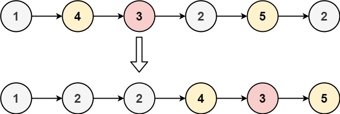

# 2.  分隔链表 
## 力扣86题 
给你一个链表的头节点 head 和一个特定值 x ，请你对链表进行分隔，使得所有 小于 x 的节点都出现在 大于或等于 x 的节点之前。

你应当 保留 两个分区中每个节点的初始相对位置。

示例 1：



输入：head = [1,4,3,2,5,2], x = 3
输出：[1,2,2,4,3,5]
示例 2：

输入：head = [2,1], x = 2
输出：[1,2]
提示：

链表中节点的数目在范围 [0, 200] 内
-100 <= Node.val <= 100
-200 <= x <= 200

**得到的结果返回新链表的头节点即可**

## 题目解析

### 思路解析

1. while 遍历链表
2. 声明两个头节点变量： left 和 right
3. 如果当前值小于 x ，放到 left
4. 如果当前值大于等于， x 放到 right
5. left 和 right 的尾部节点清空（left 可不清空）
6. 连接 left 和 right
7. 返回 left 的第一个有效节点（解法会用到虚拟头节点）

```js
/**
 * @param {ListNode} head
 * @param {number} x
 * @return {ListNode}
 */
var partition = function (head, x) {
  // 原始链表迭代 p
  let p = head;
  // 小于 x 的节点链表 注意这是虚拟头节点
  const left = new ListNode();
  // left 链表迭代 p1
  let p1 = left;
  // 大于 x 的节点链表 注意这是虚拟头节点
  const right = new ListNode();
  // right 链表迭代 p1
  let p2 = right;

// 开始迭代原始链表
  while (p) {
    // 如果本次节点小于 x
    if (p.val < x) {
      // 挂到 p1 下，且p1 向前走
      p1.next = p;
      p1 = p1.next;
    } else {
      // 大于 x 的节点挂到 p2 下
      // 且 p2 向前走
      p2.next = p;
      p2 = p2.next;
    }
    // 原始链表无论哪种情况，都要向前走
    p = p.next;
  }
  // 右侧链表最后一个 next 需要清空，否则有可能出现链表有环的情况
  p2.next = null;
  // 左边最后一个节点指向右边第一个有效节点，因为 right 是虚拟头节点，所以需要 next
  p1.next = right.next;
  // 返回新链表的头节点
  return left.next;
};

```

